# Enterprise-Grade SaaS Architecture Plan

## Vision: Premium Minimalist SaaS Platform

### Branding Principles

- **Minimalist but Premium**: Clean interfaces with subtle premium touches
- **Consistent Experience**: Unified design language across all pages
- **Enterprise-Grade**: Professional, scalable, and accessible
- **Feature Discovery**: Intuitive navigation with progressive disclosure

## New Navigation Architecture

### Main Navigation Structure

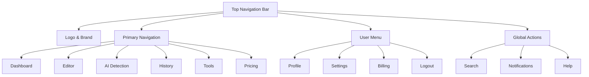

### Sidebar Navigation (When Logged In)

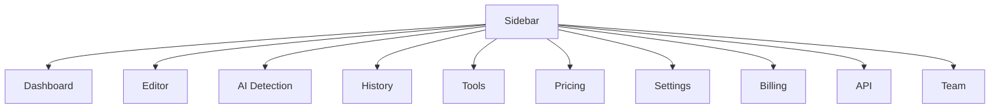

## Dedicated Feature Pages

### 1. AI Detection Page (`/ai-detection`)

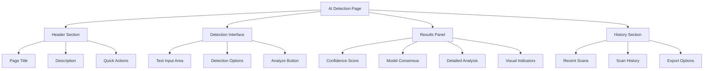

### 2. Revamped History Page (`/history`)

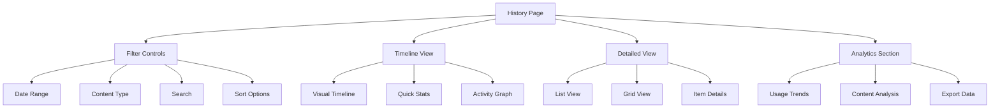

### 3. Enhanced Dashboard (`/dashboard`)

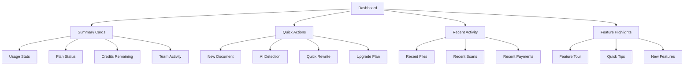

## Component Architecture

### Core UI Components

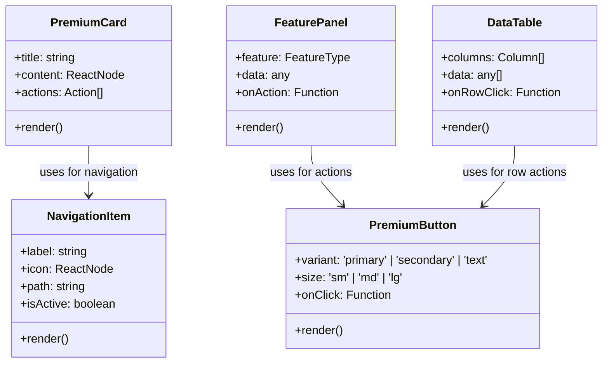

### Page Layout System

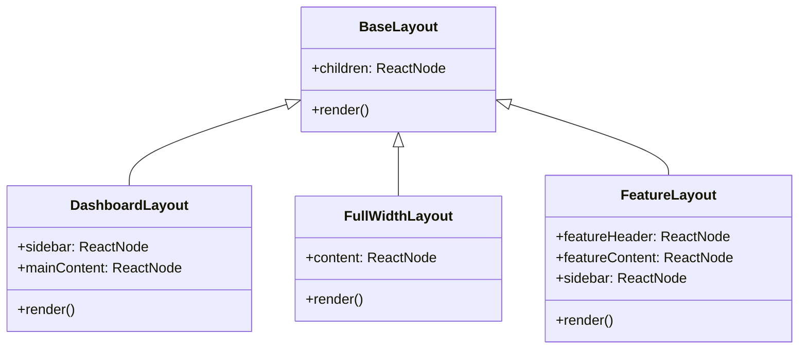

## Branding System

### Color Palette

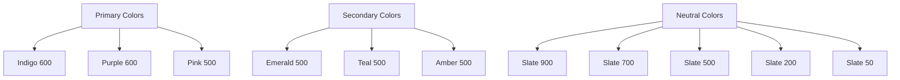

### Typography System

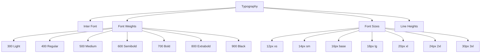

## Implementation Roadmap

### Phase 1: Foundation (Week 1)

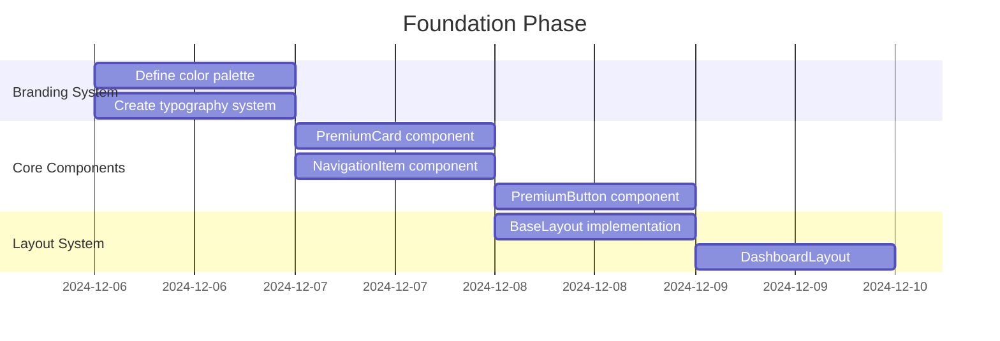

### Phase 2: Feature Pages (Week 2)

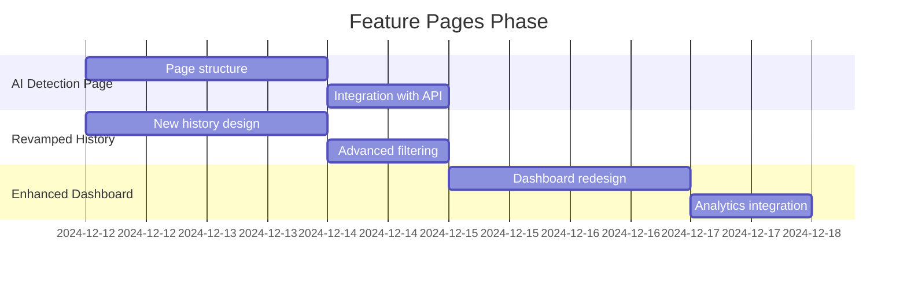

### Phase 3: Navigation & Integration (Week 3)

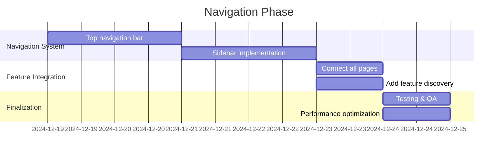

## Key Design Principles

1. **Consistent Spacing**: Use 8px grid system throughout
2. **Premium Elevation**: Subtle shadows and depth effects
3. **Minimalist Typography**: Clean, readable text with proper hierarchy
4. **Accessible Colors**: WCAG AA compliance for all interactive elements
5. **Responsive Design**: Mobile-first approach with desktop enhancements
6. **Performance Focus**: Optimized assets and lazy loading
7. **Enterprise Features**: Team collaboration, API access, and admin controls

## Success Metrics

- ✅ Unified navigation across all pages
- ✅ Dedicated feature pages with proper UI
- ✅ Consistent premium branding
- ✅ Intuitive feature discovery
- ✅ Enterprise-grade component architecture
- ✅ Performance-optimized interfaces
- ✅ Full accessibility compliance
