# Feature Comparison: Current vs Desired State

## AI Detection Feature

### Current State

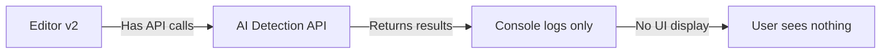

### Desired State

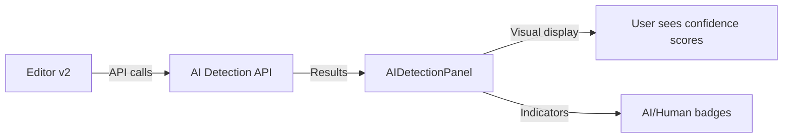

## Payment Features

### Current State

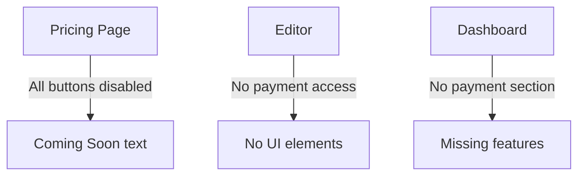

### Desired State

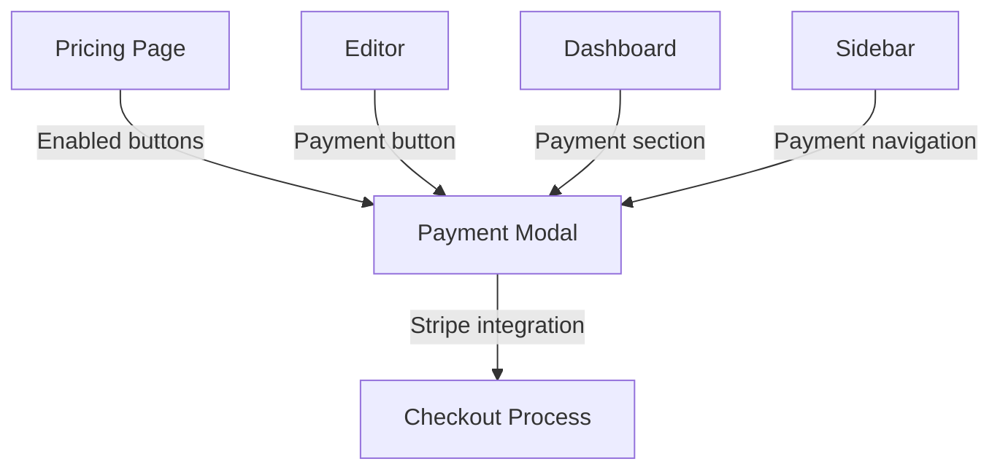

## Navigation Structure

### Current Navigation

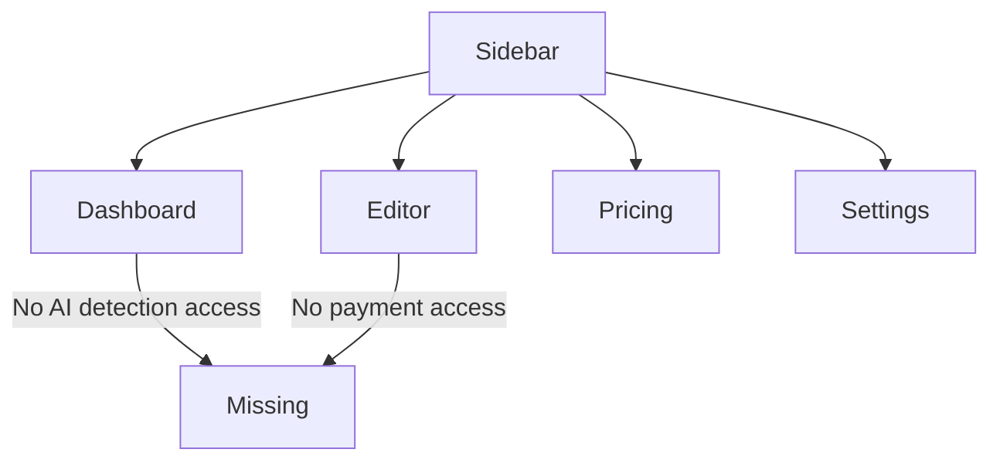

### Desired Navigation

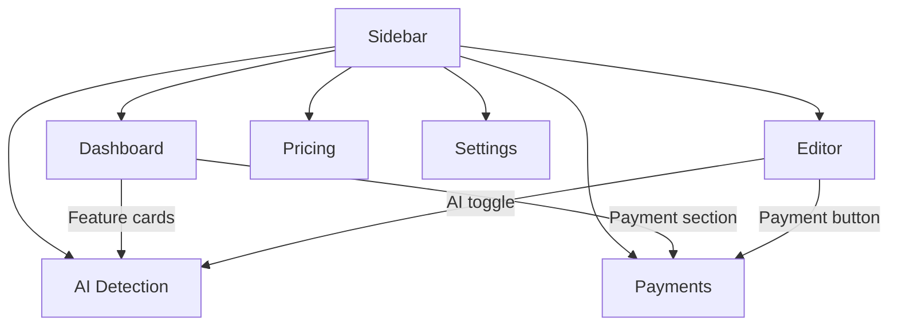

## Component Architecture

### Current Components

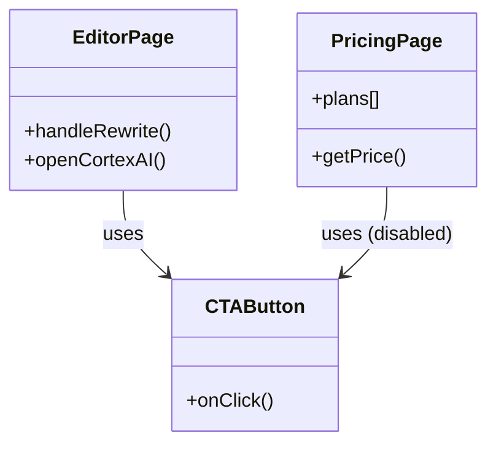

### Desired Components

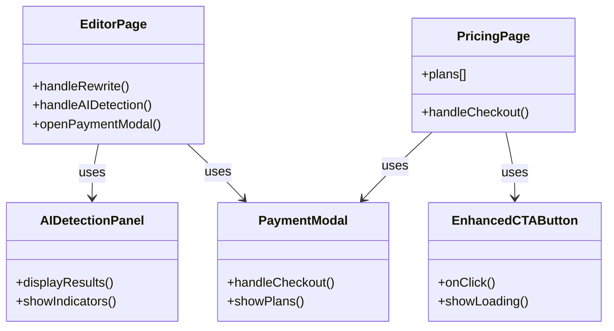

## Implementation Roadmap

### Week 1: Core Feature Enablement

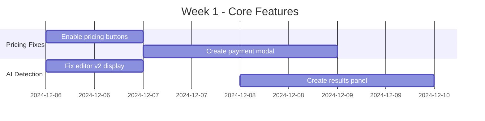

### Week 2: UI Enhancements

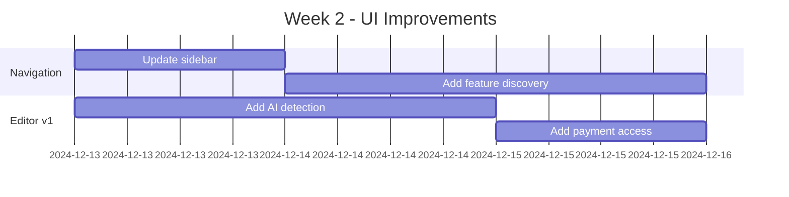

### Week 3: Testing & Optimization

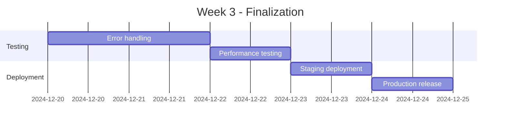

## Key Metrics for Success

- ✅ AI detection results visible in UI
- ✅ Payment buttons functional and connected
- ✅ Navigation includes all features
- ✅ Error handling prevents crashes
- ✅ Performance remains optimal
- ✅ User can access features from multiple entry points
