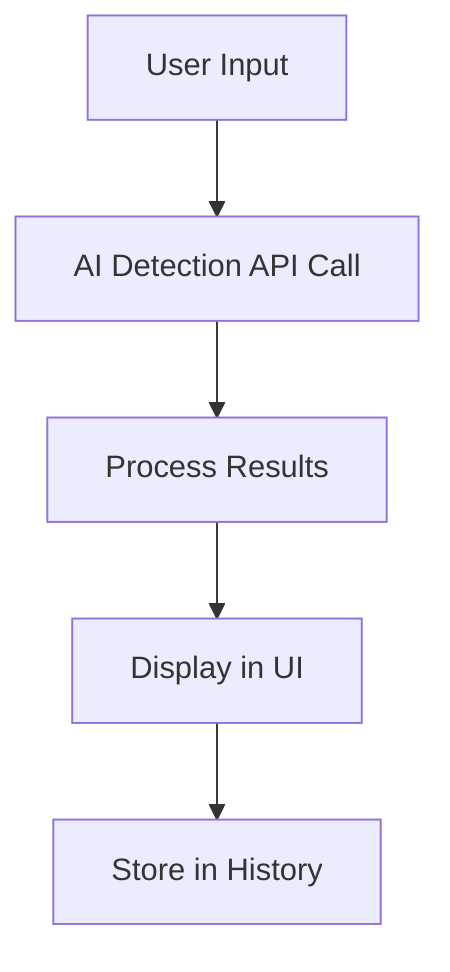
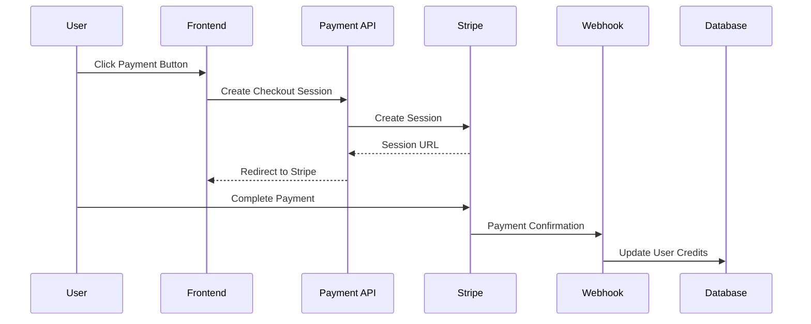

# Implementation Plan for Missing Features

## Phase 1: Enable Existing Features (Quick Wins)

### Step 1: Fix Pricing Page Restrictions

**File**: `src/app/pricing/page.tsx`
**Changes**:

- Remove `disabled={plan.name !== "Free"}` from CTA buttons
- Remove "Coming Soon" text and replace with actual functionality
- Connect buttons to payment API

### Step 2: Enable AI Detection in Editor v2

**File**: `src/app/editor-v2/page.tsx`
**Changes**:

- Ensure AI detection results are properly displayed
- Add visual indicators for AI detection status
- Connect to existing AI detection API calls

### Step 3: Create Basic Payment Modal

**File**: `src/components/PaymentModal.tsx` (new)
**Content**:

- Modal component for payment checkout
- Integration with Stripe API
- Success/error handling

## Phase 2: UI Enhancements

### Step 4: Create AI Detection Results Panel

**File**: `src/components/AIDetectionPanel.tsx` (new)
**Content**:

- Display AI detection confidence scores
- Show model consensus and reasoning
- Visual indicators for AI vs human content

### Step 5: Enhance Editor v1 with AI Detection

**File**: `src/app/editor/page.tsx`
**Changes**:

- Add AI detection toggle button
- Integrate with AI detection API
- Display results in sidebar or modal

### Step 6: Add Payment Access Points

**Files**:

- `src/components/Sidebar.tsx` - Add payment navigation
- `src/app/editor/page.tsx` - Add payment button
- `src/app/dashboard/page.tsx` - Add payment section

## Phase 3: Navigation Improvements

### Step 7: Update Sidebar Navigation

**File**: `src/components/Sidebar.tsx`
**Changes**:

- Add "AI Detection" navigation item
- Add "Payments" navigation item
- Update icons and styling

### Step 8: Create Feature Discovery Components

**File**: `src/components/FeatureTour.tsx` (new)
**Content**:

- Onboarding tour for new features
- Tooltips and guides
- Feature highlights

## Phase 4: Testing & Optimization

### Step 9: Add Error Handling

**Files**: All modified components
**Changes**:

- Add proper error states
- Implement loading indicators
- Add retry mechanisms

### Step 10: Performance Optimization

**Files**: API routes and components
**Changes**:

- Add caching for API responses
- Implement debouncing for real-time features
- Optimize component rendering

## Implementation Details

### AI Detection Integration

### Payment Flow

## Priority Order

1. Enable pricing page buttons (immediate impact)
2. Fix AI detection display in editor v2
3. Create payment modal
4. Add navigation items
5. Enhance error handling
6. Add feature discovery

## Success Metrics

- AI detection feature visible and functional
- Payment buttons working and connected to Stripe
- Users can access features from multiple entry points
- Error handling prevents crashes
- Performance remains optimal
